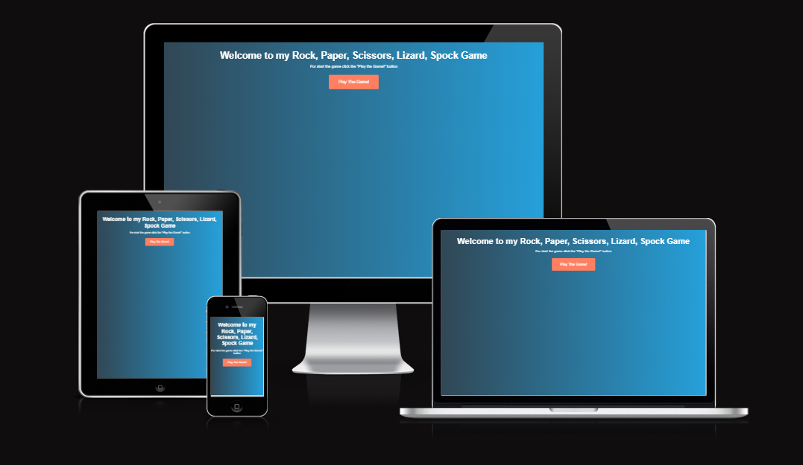
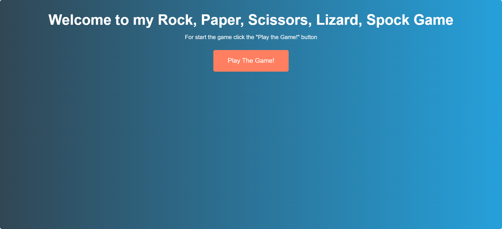
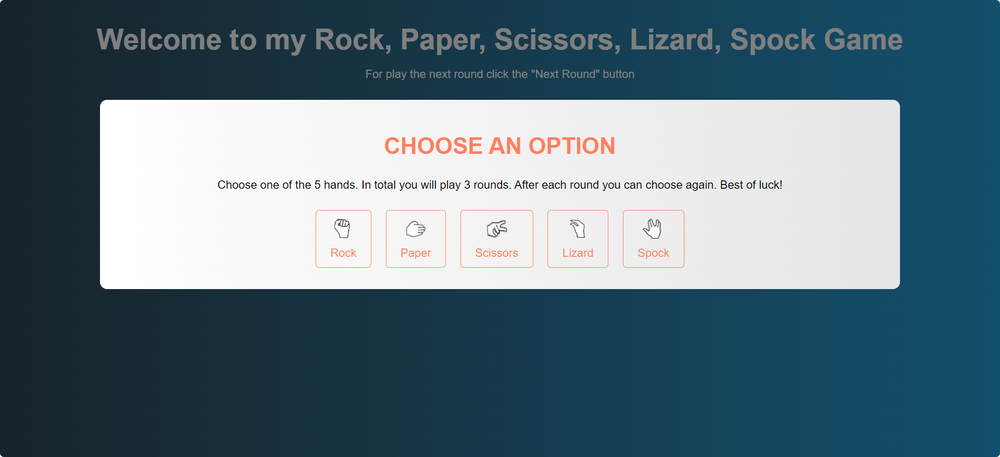
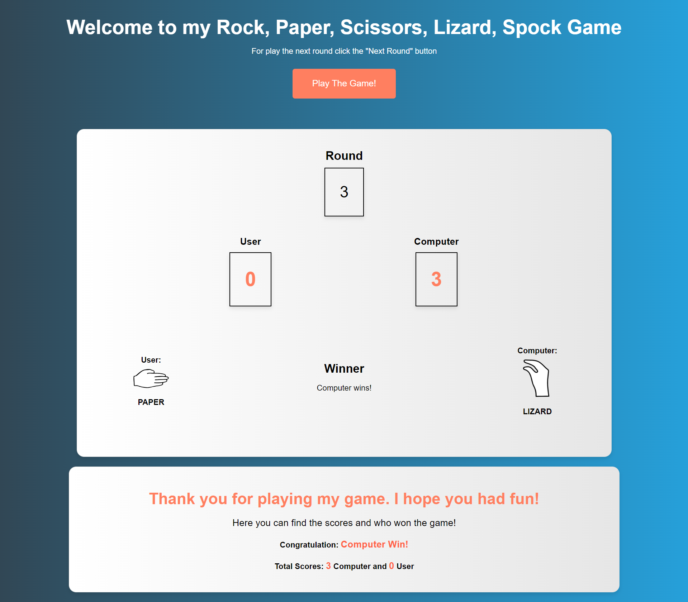
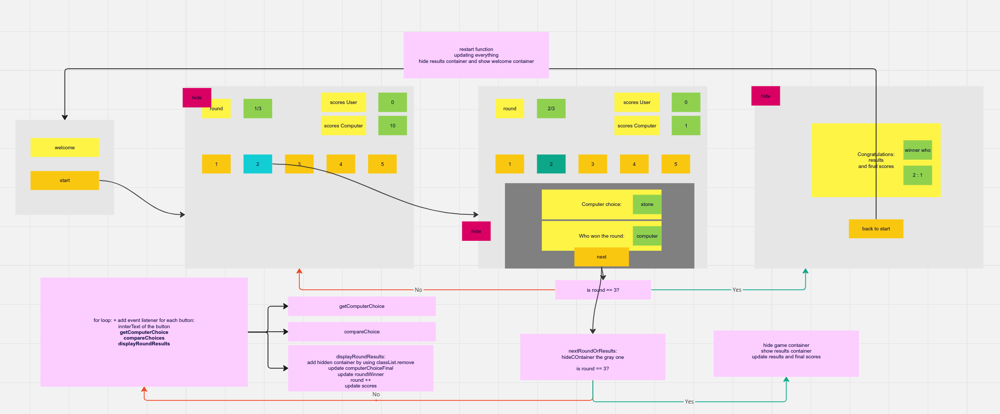

# *Project JS - Rock, Paper, Scissors, Lizard, Spock Game*

Welcome to my JavaScript Rock, Paper, Scissors, Lizard and Spock game. This project allows the user to play the famous game from the TV series "The Big Bang Theory".  

the site can be accessed by this [link](https://elkocho1.github.io/Project-CI-2/)

---

## User Stories

### First Time Visitor Goals:

- As a first-time visitor, I want to easily understand the main purpose of the game, so I can play it directly.
- As a first-time visitor, I want to easily navigate through the game, so I can find the content.
- As a first-time visitor, I want to have fun playing the game.

### Returning Visitor Goals:

- As a returning visitor, I want to play as many rounds as possible.
- As a returning visitor, I want to start the game fast with view clicks.

### Frequent Visitor Goals:

- As a frequent user, I want to have constant access to the game, so I can play it during my free time.
- As a frequent user, I want to play the game on mobile, so I can play it from anywhere.

## Features

### Menu Page

- Represent:
    - The main goal of the game.
    - Emphasize the easiness of using the game.
    - Provides the rules to play.
    - Menu Page has 1 H1 title, an introduction message to explain the game and 1 button to start the game.

---

### Pop Up Page

- Inside the Pop Up we have a clear introduction for playing the game.
- In total, the user has to play 3 rounds to win or lose the game.
- There are 5 buttons with an image of the hand the user can choose his hand.
- After clicking one of the choices the Pop Up will be closed and the user can see the winner of the round

---

### Score Page

- On the score page, we can see the current round count, the user scores and the computer scores.
- It displays the user´s hand choice and the computer´s hand choice.
- It displays the winner of the round or if it is a tie.
- It displays a button to play the next round.

---

### Winner Page

- It displays with the third round under the third score container.
- It displays a thank you message.
- It displays the winner of the game and the scores each player scored during the game.

---

## Flowchart

The flowchart represents the approach to this game and the first logic but during the development, the author added several functions and logic.

---

## Technologies Used

- [HTML](https://developer.mozilla.org/en-US/docs/Web/HTML) was used as the foundation of the site.
- [CSS](https://developer.mozilla.org/en-US/docs/Web/css) was used to add the styles and layout of the site.
- [CSS-Flexbox](https://developer.mozilla.org/en-US/docs/Learn/CSS/CSS_layout/Flexbox) was used to arrange items symmetrically on the pages.
- [CSS-Roots](https://developer.mozilla.org/en-US/docs/Web/CSS/:root) was used to declare global CSS variables and apply them throughout the project.
- [JS](https://www.w3schools.com/js/) was used to add interactivity to the site.
- [VS-Code](https://code.visualstudio.com/) was used as the main tool to write and edit code.
- [Git](https://git-scm.com/) was used for the version control of the website.
- [GitHub](https://github.com/) was used to host the code of the website.
- [Canva](https://www.canva.com/) was used to make and resize images for the project and readme files.

---

## Design

dark linear blue gradient was used to reduce visual pressure.

white was used to increase the contrast to the dark background color.

orange background was used to increase the contrast to the dark background color.

a dark orange background was used to give the user an insight into the cursor position.

white linear gradient color was used to reduce the visual pressure.

black color was used to increase the contrast to the dark background color.